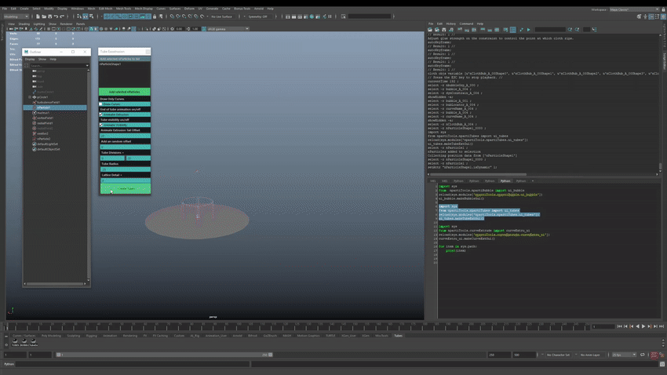
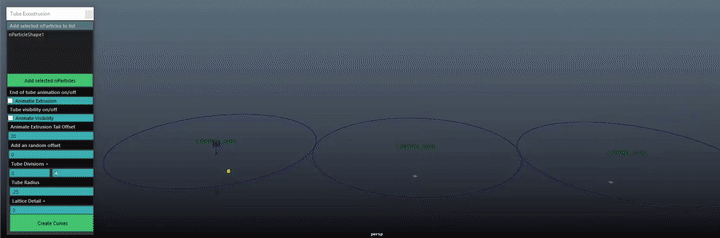
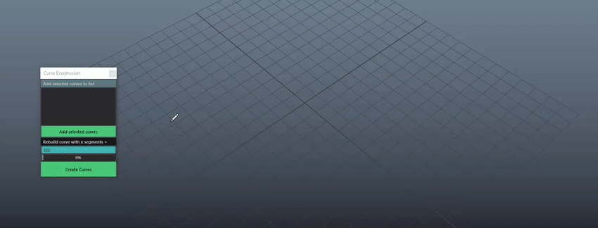

# npartiTools



This tool combines several tools that exist in the ../scripts repository which will be removed soon. This update has more features and a UI bug fixes. This tool has UI's for tube extrusion, bubble scripts and curve extrusion, additional tools will be added shortly. Modify the downloaded folder from npartiTools-master > npartiTools and then place into a folder accessible by Maya.

Tube Extrusion


](https://youtu.be/ef1B6UXzRR4)

To load the UI copy, paste and execute the lines below in the script editor under Python witin Maya. Otherwise copy to the script editor and drag the code to a shelf and add the snippet as python.

```
from npartiTools.npartiTubes import ui_tubes
ui_tubes.makeTubeExtGui()
```

nBubbles


To load the UI copy, paste and execute the lines below in the script editor under Python witin Maya. Otherwise copy to the script editor and drag the code to a shelf and add the snippet as python.

```
from  npartiTools.npartiBubble import ui_bubble
ui_bubble.makeBubbleGui()
```

Curve Extrusion



```
from npartiTools.curveExtrude import curveExtru_ui
curveExtru_ui.makeCurveExtGui()
```
